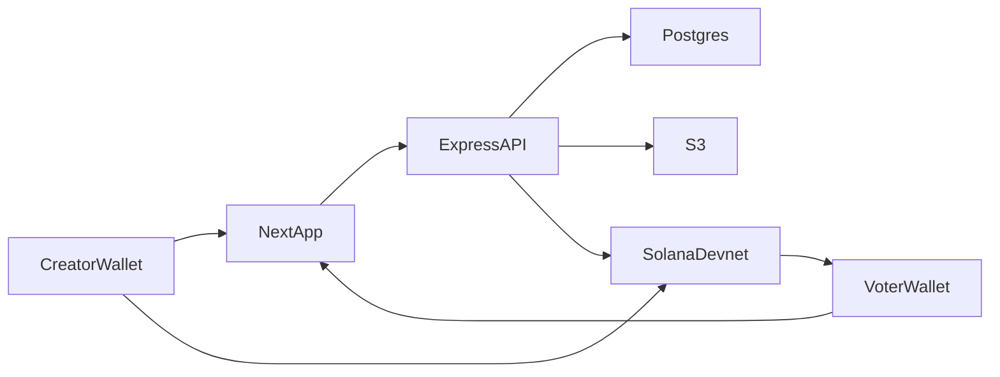

# CrowdLens

**A community-powered content oracle for creators**

A Solana app where creators escrow SOL, real humans vote on which thumbnail or poster wins, and validators get paid for consensus-aligned votes.

| | |
| --- | --- |
| **Stage** | MVP |
| **Date** | 26 September 2026 |
| **Network** | Solana Devnet only |

---

## Links

| Surface | URL |
| --- | --- |
| App | https://crowdlens-bay.vercel.app |
| Creator | https://crowdlens-bay.vercel.app/creator |
| Validator | https://crowdlens-bay.vercel.app/voter |
| API health | https://crowdlens-api.vercel.app/health |
| Repository | https://github.com/naveedstack/crowd-lens |
| Program ID | `4DcAdpaXFFvzLVDxjHoswyKojaueMuQBF4cMTY4XNfw4` |
| Devnet faucet | https://faucet.solana.com |

Use **Phantom on Devnet**. Mainnet will not show task pay-ins or voter payouts.

---

## Problem

Creators often struggle to choose the best version of their content — especially thumbnails and poster designs. Traditional A/B testing is slow, expensive, or limited to a small, biased group.

There is no simple, incentivized way for real humans to pick a winner, get paid for useful votes, and leave a public record of which option actually won.

---

## Solution

CrowdLens is a decentralized voting oracle for subjective visual content.

1. A creator uploads multiple image variations, sets how many votes they need, and escrows SOL on Solana.
2. Validators — real humans with connected wallets — vote on the most effective version.
3. When the batch fills, the majority option is committed on-chain with a hash of the vote set.
4. Escrow pays validators in SOL. Voters who matched consensus earn more; outliers earn less.
5. A reputation score tracks aligned vs outlier votes so quality input is visible on the validator profile.

The result is a readable on-chain winner, not a private spreadsheet poll.

---

## What ships today

- Wallet sign-in with a one-time nonce (creator and validator roles)
- `/creator` — upload images, pick a batch size, pay in SOL, list tasks, see results
- `/voter` — open-task queue, vote (optional comment), history, earnings
- Task results — vote counts per option and the winning option when the batch is done
- Reputation — aligned votes raise reputation; outlier votes lower it (0–100)
- Consensus payout split — majority voters receive a larger share; minority votes are haircut
- Anti-sybil basics — cannot vote on your own task; short dwell after a task is served; minimum gap between votes
- Live pricing — creator **$1 per vote**, validator **$0.50 per vote**, converted to SOL at the live rate
- On-chain escrow settlement — creator funds a task PDA; after voting, the API commits the winner, pays voters from escrow, and closes the account

---

## User flows

Phantom must be on **Devnet**. Empty wallets can use https://faucet.solana.com.

### Creator

1. Open https://crowdlens-bay.vercel.app/creator and connect a wallet.
2. Approve the sign-in message.
3. Create a task: title, two or more images, vote count (1–100).
4. Pay the quoted SOL. That transaction funds the on-chain escrow PDA.
5. Share `/voter` so other wallets can fill the batch.
6. Open the task page for vote counts and the winner.

A creator cannot vote on their own task. Use a second wallet as the validator.

### Validator

1. Open https://crowdlens-bay.vercel.app/voter with a **different** wallet on Devnet.
2. Connect, sign in, pick an open task, choose an option, vote.
3. When the required number of votes is reached, escrow pays SOL **directly to this wallet**.
4. Earnings and History show the amount and an Explorer link for the payout transaction.

**Withdraw** is only for leftover pending from older custodial (off-chain treasury) tasks. In on-chain mode the navbar shows the last amount paid to the Devnet wallet, not a balance waiting to withdraw.

---

## Architecture

Votes are stored in Postgres. Solana holds the escrow, a commitment hash of the vote set, the winning option id, and the SOL transfers.



| Piece | Role |
| --- | --- |
| Next.js app | Landing `/`, creator `/creator`, validator `/voter` |
| Express API | Auth, tasks, votes, quotes, escrow settlement |
| PostgreSQL + Prisma | Users, workers, tasks, options, submissions, payouts, reputation |
| AWS S3 | Presigned browser upload of task images |
| Solana Devnet | Creator pay-in, task PDA, voter payouts |
| API treasury key | Oracle authority: `commit_votes`, `settle_chunk`, `close_task` (not the voter’s wallet) |

---

## On-chain program

**Program ID:** `4DcAdpaXFFvzLVDxjHoswyKojaueMuQBF4cMTY4XNfw4`

Each task is a PDA escrow. Individual votes are **not** each an on-chain transaction.

| Instruction | What it does |
| --- | --- |
| `initialize` | Config PDA; treasury wallet is the authority |
| `create_task` | Creator pays rent + escrow amount; stores amount and required vote count |
| `commit_votes` | One-shot: 32-byte vote commitment and `winner_option_id` |
| `settle_chunk` | Pays one or more validator wallets from remaining escrow |
| `close_task` | Sends leftover platform SOL to the authority; rent returns to the creator |

The `TaskEscrow` account includes creator, nonce, amount, required votes, remaining lamports, `vote_commitment`, chunks paid, settled flag, and `winner_option_id` (0 means tie / none). After `close_task` the PDA is gone; the winner remains in the `commit_votes` transaction on Explorer.

---

## Economics

Quoted in USD, settled in SOL at a live rate (Jupiter, then CoinGecko fallback).

| Rule | Value |
| --- | --- |
| Creator pays | **$1** per requested vote |
| Validator base share | **$0.50** per vote (half of the creator lamports, floored) |
| Batch size | **1–100** votes |
| Majority vs minority | Aligned voters share a bonus taken from outlier haircuts |
| Network | Devnet only |

Example: a 1-vote task costs about **$1 in SOL**. The single voter receives about **$0.50 in SOL** in their wallet when the batch closes.

---

## Tech stack

Solana, Anchor, Phantom (wallet adapter), Next.js, React, TypeScript, Express, PostgreSQL, Prisma, AWS S3, Vercel, Tailwind CSS, Bun.

---

## Repository map

GitHub: https://github.com/naveedstack/crowd-lens  
Application code lives under `CrowdLens/`.

| Path | Contents |
| --- | --- |
| `apps/frontend` | Next.js app (landing, creator, voter) |
| `apps/api` | Express API |
| `packages/db` | Prisma schema and migrations |
| `packages/crowdlens-idl` | Program IDL / instruction builders |
| `anchor/` | Anchor program `crowdlens` |

---

## Demo (reviewers)

1. Set Phantom to **Devnet**. Fund two wallets from https://faucet.solana.com if needed.
2. Wallet A — open `/creator`, upload at least two images, set **1 vote**, pay the quoted SOL.
3. Confirm the pay-in on [Solana Explorer (Devnet)](https://explorer.solana.com/?cluster=devnet).
4. Wallet B — open `/voter`, sign in, vote on that task.
5. Wallet B should receive ~$0.50 of Devnet SOL. The payout instruction is `SettleChunk`.
6. Wallet A’s task page should show the task as done and the winning option.

API check: `GET https://crowdlens-api.vercel.app/health` → `{ "ok": true }`.

---

## Out of scope (not in this MVP)

These ideas appear in the original product brief. They are **not** implemented and must not be treated as shipped:

- Lens AI / generative suggestions from vote data
- Product surfaces for AI teams or training-data labeling
- Creator caption / text tasks (image tasks only)
- SOL slashing
- Compressed NFTs (cNFTs) for vote receipts or badges
- Mainnet

---

## Local run

Full environment notes: [README.md](../README.md).

```bash
bun install
bun run db:migrate
bun run --filter=api dev
bun run --filter=frontend dev
```

PostgreSQL via `docker-compose.yml` (port 5433). Copy `apps/api/.env.example` and `apps/frontend/.env.example`; never commit real keys.
