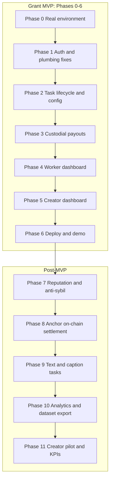

# CrowdLens Masterplan

Phased plan to take CrowdLens from the current UI-preview MVP shell to a credible grant-ready product, and then on toward the full Superteam idea.

**Target for the grant MVP:** Phases 0 through 6. Everything after Phase 6 is post-MVP.

**Explicitly out of scope for now (by decision):**

- Lens AI / AI feedback engine
- Compressed NFTs (cNFTs) for vote receipts or validator badges

**Decisions locked in:**

- Payouts start **custodial** (server sends SOL from a treasury keypair), then move on-chain in Phase 8.
- Network is **Solana devnet** only.

---

## Where the project stands today

Working:

- Marketing landing page, wallet connect, wallet-signature sign-in with JWT
- Creator flow: upload images to DigitalOcean Spaces via presigned POST, pay 0.1 SOL, create a task
- Worker flow: fetch next task, click an option, submission recorded
- Results page: vote counts per option
- UI preview mode so both apps run with no env vars ([apps/frontend/src/lib/ui-preview.ts](apps/frontend/src/lib/ui-preview.ts), [apps/worker-frontend/src/lib/ui-preview.ts](apps/worker-frontend/src/lib/ui-preview.ts))

Missing or broken:

- Tasks never complete. `Task.done` is only ever read as `false` in [apps/api/src/db.ts](apps/api/src/db.ts); nothing sets it to `true`.
- No payout path. Workers accrue `pending_amount` but there is no withdraw endpoint and no SOL ever leaves the treasury.
- `Payouts` in [packages/db/prisma/schema.prisma](packages/db/prisma/schema.prisma) relates to `User`, not `Worker`, so it cannot record validator payouts.
- Worker UI is a single screen. `GET /api/v1/worker/balance` exists but is never called; there is a `TODO` for it in [apps/worker-frontend/src/components/NextTask.tsx](apps/worker-frontend/src/components/NextTask.tsx).
- Creator has no task list, only `/dashboard/task/[taskId]` by direct id.
- Token format mismatch: [apps/frontend/src/components/Navbar.tsx](apps/frontend/src/components/Navbar.tsx) stores the raw JWT while [apps/frontend/src/app/dashboard/components/Appbar.tsx](apps/frontend/src/app/dashboard/components/Appbar.tsx) stores `Bearer <jwt>`. The middleware does `authHeader.split(" ")[1]`, so a raw token fails auth.
- Hardcoded economics: `TOTAL_SUBMISSIONS = 100` in [apps/api/src/routers/worker.ts](apps/api/src/routers/worker.ts), `100000000` lamport check and `0.1 * LAMPORTS_PER_SOL` in [apps/api/src/routers/user.ts](apps/api/src/routers/user.ts).
- No reputation, no slashing, no rate limiting, no self-vote prevention.
- No env validation. [apps/api/.env.example](apps/api/.env.example) is missing `WORKER_JWT_SECRET` and `RPC_URL`; neither frontend has an example file.

---

# Phase 0: Run the real stack

**Goal:** get off UI preview mode and have the full creator-to-worker loop working locally against a real database and devnet.

**Blockers found while implementing (the code was not just unconfigured):**

1. **Sign-in broke over JSON.** Frontends sent the raw `Uint8Array` from `signMessage`, which `JSON.stringify` turns into `{"0":12,"1":34,...}`. The API read `signature.data`, which is `undefined`, so every sign-in returned 401. Fixed by sending `Array.from(signature)` and verifying with `new Uint8Array(signature)`.
2. **API package.json omitted `uuid` and `@solana/web3.js`.** They only resolved because Bun hoisted them from the frontend apps. Declared as real API dependencies.
3. **Storage pointed at DigitalOcean Spaces** (`blr1.digitaloceanspaces.com`) while credentials are AWS S3 (`crowd-lens-mvp`, `ap-south-1`). Client now uses `AWS_REGION` with no custom endpoint, and `public-read` ACLs were removed.
4. **Duplicate `next.config.js` and `next.config.ts`** in both Next apps. Deleted the `.js` files so image host changes actually apply.

**Manual AWS step (cannot be done from the repo):** on `crowd-lens-mvp`, turn off "Block public access" for bucket policies and attach [apps/api/s3-bucket-policy.json](apps/api/s3-bucket-policy.json). Attach [apps/api/s3-iam-user-policy.json](apps/api/s3-iam-user-policy.json) to the IAM user so it can `s3:PutObject` on `user/*` (presign currently succeeds, the browser/S3 POST then returns 403 AccessDenied). **Rotate the AWS access key** that was pasted into `.env.example` / chat; that key is burned.

Work:

- Create `.env` files: `DATABASE_URL` for [packages/db](packages/db), and for the API `JWT_SECRET`, `WORKER_JWT_SECRET`, `RPC_URL`, `S3_BUCKET_NAME`, `AWS_ACCESS_KEY_ID`, `AWS_SECRET_ACCESS_KEY`, `AWS_REGION`, `PORT`, `CORS_ORIGIN`.
- Add frontend `.env.local` files with `NEXT_PUBLIC_BACKEND_URL=http://localhost:8080` and `NEXT_PUBLIC_CLOUDFRONT_URL=https://crowd-lens-mvp.s3.ap-south-1.amazonaws.com`. Setting these auto-disables preview mode, since `isUiPreview` is just `!process.env.NEXT_PUBLIC_BACKEND_URL`.
- Update [apps/api/.env.example](apps/api/.env.example) (placeholders only — never real keys) and add example files for both frontends. Allow `.env.example` through the frontend gitignores with `!.env.example`.
- Add startup env validation in [apps/api/src/env.ts](apps/api/src/env.ts), imported first from [apps/api/src/index.ts](apps/api/src/index.ts).
- Add [docker-compose.yml](docker-compose.yml) for Postgres on 5433, plus `db:migrate` / `db:generate` scripts.
- Make the API port and CORS origin configurable via `PORT` and `CORS_ORIGIN`.
- Retry `getTransaction` a few times on task create, because the RPC can return `null` for a few seconds after the client confirms.

**Done when:** one wallet can create a task on devnet, a second wallet can vote on it, and the results page shows the vote, with no mock data anywhere.

---

# Phase 1: Auth and plumbing fixes

**Goal:** remove the bugs a grant reviewer would hit in the first five minutes.

Work:

- Standardize the token. Pick one format (`Bearer <jwt>`) and use it in [Navbar.tsx](apps/frontend/src/components/Navbar.tsx), both Appbars, [UploadImage.tsx](apps/frontend/src/app/dashboard/components/UploadImage.tsx), [Upload.tsx](apps/frontend/src/app/dashboard/components/Upload.tsx), the task page, and [NextTask.tsx](apps/worker-frontend/src/components/NextTask.tsx). Centralize it in a small `lib/auth.ts` per app.
- Handle expiry and sign-out: JWTs are signed with no `expiresIn`. Add expiry plus a clear "session expired, reconnect wallet" path, and a disconnect that clears `localStorage`.
- Nonce-based sign-in. Both routers verify a fixed message `"Sign in into Crowdlens"`, which is replayable forever. Issue a server nonce, verify it once, expire it.
- Type `req.userId` properly and delete the `//@ts-ignore` pairs in [apps/api/src/middleware.ts](apps/api/src/middleware.ts); [apps/api/types.d.ts](apps/api/types.d.ts) already declares it.
- Replace `tx: any` and the hand-written `PrismaTransaction` interface in the routers with Prisma's generated transaction type.
- Consistent API error shape and HTTP codes. The code currently returns `411` for validation and access errors; use `400` / `403` / `404` and a single `{ error, details }` body.
- Prevent self-voting: `getNextTask` in [apps/api/src/db.ts](apps/api/src/db.ts) can serve a task to a worker whose wallet is also the task creator. Exclude tasks whose `user.address` matches the worker address.
- Add basic rate limiting on sign-in and submission routes.

**Done when:** no auth path silently fails, sign-in cannot be replayed, and a creator cannot vote on their own task.

---

# Phase 2: Task lifecycle and configurable economics

**Goal:** tasks actually finish, and the reward math stops being magic numbers.

Work:

- Move economics into config: task price, votes required per task, and per-vote reward. Replace `TOTAL_SUBMISSIONS = 100` in [apps/api/src/routers/worker.ts](apps/api/src/routers/worker.ts), the `!== 100000000` payment assertion and `amount: 0.1 * LAMPORTS_PER_SOL` in [apps/api/src/routers/user.ts](apps/api/src/routers/user.ts).
- Let the creator choose a batch size (for example 20, 50, 100 votes) and derive the price from it, instead of a fixed 0.1 SOL for 100 votes.
- Store required votes on the task. Add `required_submissions` to `Task` in [schema.prisma](packages/db/prisma/schema.prisma) with a migration.
- Close the task: inside the submission transaction, count submissions and set `done = true` when the quota is reached. `getNextTask` already filters `done: false`, so closing also stops serving it.
- Add a winner concept: compute the winning option at close and expose it, so the results page can show an outcome rather than raw counts.
- Validate the payment amount against the chosen batch size, and make sure a task signature can only be consumed once (`Task.signature` is already `@unique`).
- Handle the empty case in the worker UI: when no open tasks exist, the current "check back later" screen is correct; verify it triggers via the real API (`411` today, adjust with the Phase 1 error codes).

**Done when:** a task with N required votes accepts exactly N submissions, flips to done, and reports a winner.

---

# Phase 3: Custodial payouts

**Goal:** workers can actually receive SOL. This is the single biggest credibility gap, since the README already claims payout infra.

Work:

- Fix the `Payouts` model. It currently relates to `User`; add a `worker_id` relation (or a separate `WorkerPayout` model) plus `created_at`, and keep the existing `TxnStatus` enum (`Processing`, `Success`, `Failure`).
- Add a treasury signer: keypair loaded from env (devnet), separate from the hardcoded `PARENT_WALLET_ADDRESS` in [apps/api/utils/solana.ts](apps/api/utils/solana.ts), which is only used for verification today.
- Implement `POST /api/v1/worker/payout`:
  - enforce a minimum withdrawal amount
  - move `pending_amount` into `locked_amount` inside a DB transaction before sending
  - send the SOL transfer, record the signature with status `Processing`
  - confirm the transaction, then set `Success` and clear `locked_amount`, or `Failure` and return the funds to `pending_amount`
- Make it idempotent and safe under concurrency: a retried or double-clicked withdraw must not pay twice. Use a row lock or a unique in-flight payout constraint per worker.
- Add `GET /api/v1/worker/payouts` for history.
- Add a reconciliation job or script that re-checks `Processing` payouts against the chain on boot, so a crash mid-payout is recoverable.
- Only credit rewards for submissions on tasks that exist and are open, and keep the per-vote amount consistent with Phase 2 config.

**Done when:** a worker with a balance clicks withdraw, receives devnet SOL at their wallet, and sees a confirmed payout with an explorer-verifiable signature.

---

# Phase 4: Worker dashboard

**Goal:** turn the single voting screen into the "validator dashboard" the Superteam idea describes.

Work:

- Wire up the unused `GET /api/v1/worker/balance` into the Appbar: pending and locked balance, refreshed after each vote (resolves the `TODO` in [NextTask.tsx](apps/worker-frontend/src/components/NextTask.tsx)).
- Add a dashboard route with: total earned, pending versus locked, votes submitted, withdraw button, and payout history from Phase 3.
- Add submission history: which tasks were voted on and what was picked.
- Show per-vote reward before voting so the incentive is visible.
- Improve the voting screen: progress within the batch, skip option, and optional comment. `Submission.comment` already exists in the schema and is unused.
- Empty, loading, and error states that do not look like a crash.

**Done when:** a validator can see what they earned, withdraw it, and review past work without leaving the app.

---

# Phase 5: Creator dashboard

**Goal:** a creator can manage more than one task.

Work:

- Add `GET /api/v1/user/tasks` returning the creator's tasks with status, vote progress, and amount spent.
- Add a task list page. Today [apps/frontend/src/app/dashboard/page.tsx](apps/frontend/src/app/dashboard/page.tsx) renders only the upload form, and results are reachable only by knowing the task id.
- Improve the results page ([apps/frontend/src/app/dashboard/task/[taskId]/page.tsx](apps/frontend/src/app/dashboard/task/[taskId]/page.tsx)): highlight the winner, show completion percentage and votes remaining, and show whether the task is open or done.
- Upload UX: validate option count (minimum 2, maximum 5), file type and size (the presigned POST already caps at 5MB), allow removing an image before submitting, and show upload progress.
- Make the pay-then-submit flow resilient: today `txSignature` lives only in component state, so a refresh after paying loses the payment. Persist it or create the task server-side immediately after payment confirmation.
- Show the task cost and expected turnaround before the creator pays.

**Done when:** a creator can create several tasks, see them listed with live progress, and open results for any of them.

---

# Phase 6: Deploy and demo (grant MVP milestone)

**Goal:** something a grant reviewer can open and try.

Work:

- Deploy the two Next apps (Vercel) and the API plus Postgres (Render or similar), with devnet configuration.
- Lock CORS to the deployed frontend origins.
- Seed a public demo: a few open tasks so any visitor connecting a devnet wallet can vote immediately.
- Add a devnet faucet hint in the UI so testers can get SOL.
- Record the demo video and replace the placeholder in [README.md](README.md).
- Update the README roadmap to match reality, and document the architecture and economics.
- Add basic observability: request logs and error tracking, so the pilot is debuggable.

**Done when:** a stranger with a Phantom wallet on devnet can create a task and vote on someone else's, end to end, on a public URL.

---

# Phase 7: Reputation and anti-sybil

**Goal:** make votes trustworthy, which is what separates a content oracle from a click counter.

Work:

- Add `reputation` and vote-quality fields to `Worker`, with a migration.
- Consensus alignment scoring: after a task closes, compare each vote to the outcome and adjust reputation.
- Quality-weighted rewards: pay aligned voters more than outliers, replacing the flat `amount / votes` split.
- Slashing: use the existing `locked_amount` to withhold or reclaim rewards for spam and random voting.
- Sybil resistance: minimum time on task, per-wallet and per-IP rate limits, and a minimum wallet age or activity check.
- Keep the existing `@@unique([worker_id, task_id])` protection on `Submission` and add server-side checks for rapid-fire voting.

**Done when:** a spam voter earns measurably less than an honest voter and can be slashed.

---

# Phase 8: Anchor program (on-chain settlement)

**Goal:** move the oracle on-chain, which is the core claim of the Superteam idea. There is currently no Anchor program in the repo.

Work:

- Scaffold an Anchor workspace in the monorepo with a devnet deploy.
- Program instructions: create task with escrowed funds, record vote (or a signed vote batch), close task, and settle payouts to validators.
- Escrow task funds in a PDA at creation instead of a plain transfer to a treasury wallet.
- Settlement on-chain so payouts come from the program, replacing the custodial transfer from Phase 3. Keep the custodial path behind a flag during migration.
- Generate a typed client from the IDL and use it in both the API and the frontends.
- Index on-chain state back into Postgres so the UI stays fast, treating the chain as the source of truth.
- Program tests, plus a plan for a light audit or review before any mainnet consideration.

**Done when:** task funds are escrowed on devnet, votes are verifiable on-chain, and validator payouts are program-driven.

---

# Phase 9: Text and caption tasks

**Goal:** support the content types already promised in the README beyond images.

Work:

- Generalize `Option` in [schema.prisma](packages/db/prisma/schema.prisma): add a type (image, text) and a content field, keeping `image_url` for backward compatibility.
- Creator UI for text options (captions, titles, hooks).
- Worker UI that renders text options as cards rather than images.
- Keep result aggregation and payouts content-type agnostic.

**Done when:** a creator can run a caption A/B test through the same flow as thumbnails.

---

# Phase 10: Analytics and dataset export

**Goal:** back up the "transparent analytics" and "tokenized feedback dataset" claims.

Work:

- Per-task analytics: vote distribution over time, completion rate, and average turnaround (the README targets under 5 minutes per batch).
- Validator contribution stats and a leaderboard.
- Platform stats page for the KPI claims (total votes, unique validators).
- Dataset export (CSV or JSON) of anonymized votes for AI teams, which is the on-ramp to the AI layer later.
- Optional: aggregated demographic or segment tags, which the marketing copy currently implies but the schema does not support.

**Done when:** a creator sees real analytics and a data buyer can export a clean vote dataset.

---

# Phase 11: Creator pilot and KPIs

**Goal:** evidence for the grant, not just features.

Work:

- Recruit 3 to 5 creators for real batches, per the README roadmap.
- Instrument the KPIs: 10,000+ votes, 500+ unique validators, under 5 minutes average batch turnaround.
- Feedback loop and iteration from pilot findings.
- Public case studies or before-and-after CTR results.
- Decide on the mainnet cutover and real-money economics after the pilot.

**Done when:** there are real tasks, real validators, and numbers to report.

---

## Deferred by decision

- **Lens AI:** vote summaries and generative content suggestions. Phase 10's dataset export is the prerequisite, so this slots in after it when we pick it up.
- **Compressed NFTs:** vote receipts and validator badges. Best added after Phase 8, since it depends on on-chain state.
